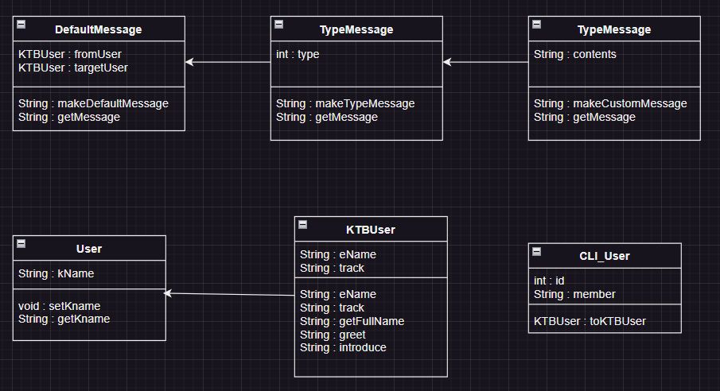
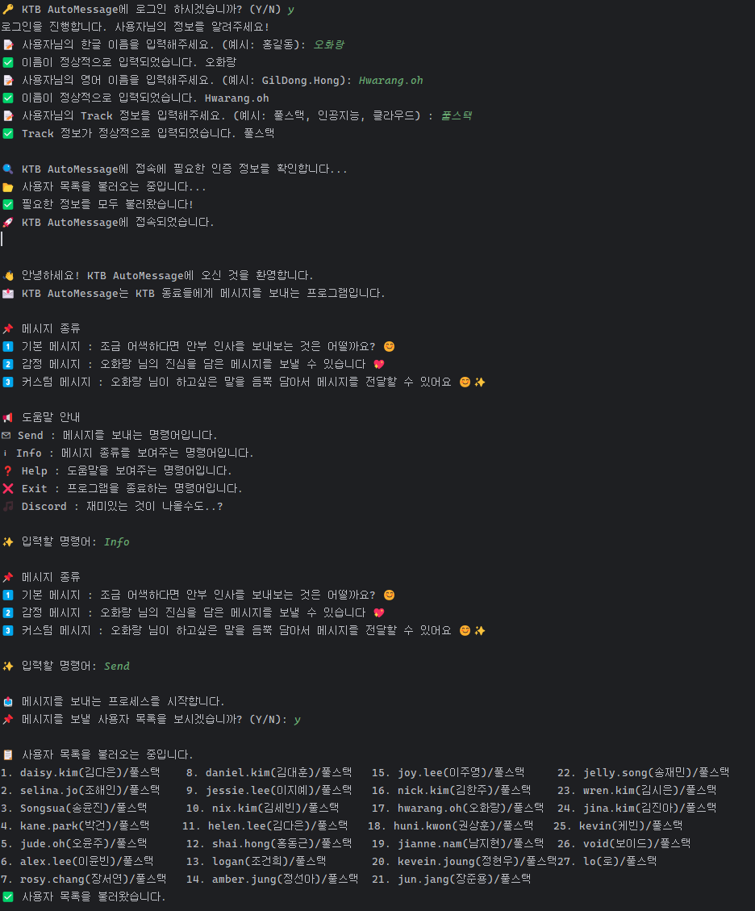
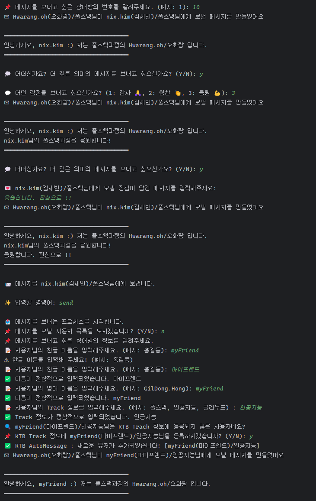
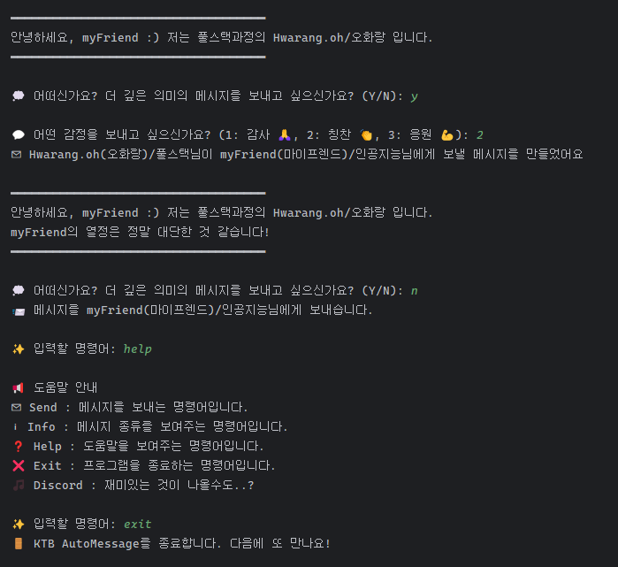

# KTB AutoMessage 🚀

KTB AutoMessage는 KTB 동료들에게 메시지를 전송하는 CLI + Discord 기반의 자동 메시징 프로그램입니다.
사용자는 간단한 명령어 입력을 통해 동료들에게 감사, 칭찬, 응원의 메시지를 보낼 수 있으며,
필요 시 커스텀 메시지를 작성하여 더욱 진심이 담긴 소통이 가능합니다. 😊

## 📊 클래스 다이어그램



## 📌 주요 기능

### 🔑 로그인

- 사용자는 프로그램 실행 시, **KTB AutoMessage**에 로그인할 수 있습니다.
- 한글 이름, 영어 이름, 트랙 정보를 입력하여 로그인 진행.
- 기존 사용자 목록을 불러오며, 새로운 사용자는 자동으로 데이터에 추가.

### 📩 메시지 전송 기능

- `Send` 명령어 입력 시, 메시지를 보낼 상대를 선택하거나 직접 입력 가능.
- **기본 메시지** : 간단한 안부 인사 메시지를 전송.
- **감정 메시지** : 감사(🙏), 칭찬(👏), 응원(💪) 중 하나를 선택하여 감정 메시지 전송.
- **커스텀 메시지** : 직접 입력한 메시지를 추가하여 감정을 더욱 깊이 표현 가능.
- 모든 메시지는 꾸며진 레이아웃을 통해 강조된 형태로 표시됨.

### 📢 도움말 및 안내

- `Info` : 메시지 종류 및 설명 제공.
- `Help` : 사용 가능한 명령어 안내.
- `Discord` : Discord 실행 방법 안내 (예정).
- `Exit` : 프로그램 종료.

## 🛠 프로그램 실행 방법

1. **프로젝트 다운로드 및 빌드**
   ```bash
   git clone https://github.com/your-repo/KTB-AutoMessage.git
   cd KTB-AutoMessage
   ```
2. **프로그램 실행**
   ```bash
   java -jar KTB_AutoMessage.jar
   ```
3. **로그인 후 명령어 입력**
   - `Send` : 메시지 전송
   - `Info` : 메시지 종류 확인
   - `Help` : 도움말
   - `Exit` : 프로그램 종료

## 📂 데이터 저장 방식

- 사용자는 `data.json` 파일을 통해 관리됩니다.
- 새로운 사용자가 추가되면 자동으로 JSON 파일 업데이트.
- 메시지 전송 시, 현재 로그인한 사용자와 상대방의 정보가 JSON에서 불러와짐.

## ✨ 프로그램 시연





## 🛠 기술 스택

- **Java 17+**
- **Gson** (JSON 데이터 관리)
- **JDA** (Java Discord API)

## 🏆 추가 내용

- 데이터가 손실되지 않도록 **JSON 기반 저장 방식** 채택.
- 향후 **JAVA CLI 기반 디스코드 메시징** 업데이트 예정.
