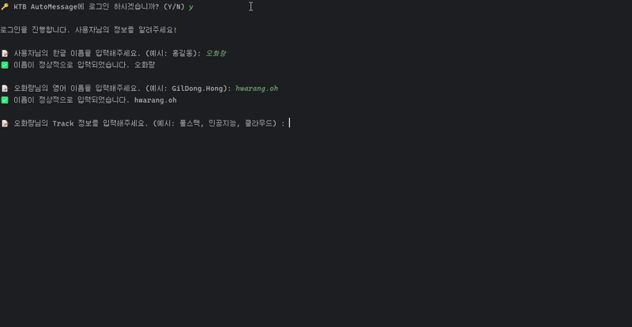

# KTB AutoMessage 🚀

KTB AutoMessage는 KTB 동료들에게 메시지를 전송하는 CLI + Discord 기반의 자동 메시징 프로그램입니다.
사용자는 간단한 명령어 입력을 통해 동료들에게 감사, 칭찬, 응원의 메시지를 보낼 수 있으며,
필요 시 커스텀 메시지를 작성하여 더욱 진심이 담긴 소통이 가능합니다. 😊

## 📊 KTB Version 1

### 🔹 [Version 1 README](/automessage/README_1주차.md)

## 📌 KTB AutoMessage Version 2 업데이트

### 🧪 Test 환경의 도입

- **Junit 5 & Mockito** 기반의 Test 환경 구축
- 간단하게 몇개 Test를 진행하였음

### 🔧 ContentsUtil의 Message 기능을 MessageController, MessageService로 분리

- 진행을 담당하는 ContentsUtil에 몰려 있던, Message에 대한 기능을 분리했습니다.
- Message 기능들은 MessageController에서 MessageService에 구현된 수를 불러 사용하도록 했습니다.

### 🔧 ContentsUtil의 Login 기능을 UserController, UserService로 분리

- ContentsUtil에 몰려 있던, Login과 User 유효성 검사에 대한 기능을 분리했습니다.
- 유효성 검사에 대한 Package와 Class를 따로 분리했습니다.
- UserController가 UserService를 통해 UserValidator과 Login에 대한 기능을 호출하여 사용합니다.

### 🔧 Validator 기능 분리 및 향후 확장성 고려

- Validator Class를 따로 분류했습니다.
- Contents의 흐름에 대하 내용은 빼고, 순수하게 유효성 검사에 대한 기능만 포함되도록 했습니다.

### ✨ MessageType에 대한 Enum 추가 및 Exception 처리

- 기존의 MessageType을 고르는 방법은 숫자를 선택하여, Matching하는 방법이었습니다.
- Version 1.5에서는 MessageType을 Enum으로 정의하여, 직관적으로 Type을 적어서 선택하도록 했습니다.

### ✨ Exception 클래스 활용한 Custom Exception 처리 적용

- MessageType에 대한 Enum이 정의되면서, 새로운 CustomException을 만들었습니다.
- MessageTypeException

### ✨ Thread를 활용한 I/O 및 Reply Message 처리

- Login을 진행할 때, data를 가져오는 과정을 Thread로 처리했습니다.
- Message를 보내고 나면, Message를 Queue에 집어 넣고 마치 답장이 오는 것 처럼 기능하는 Thread를 만들었습니다.

## 🎥 프로그램 시연

## 🛠 기술 스택

- **Java 17+**
- **Gson** (JSON 데이터 관리)
- **JDA** (Java Discord API)

## 🏆 추가 내용

- Reply가 올 때, 발생하는 Message 끊김 해결.
- 여러 사용자가, 서로 Message를 주고 받는 상황 설계.
- 향후 **JAVA CLI 기반 디스코드 메시징** 업데이트 예정.
