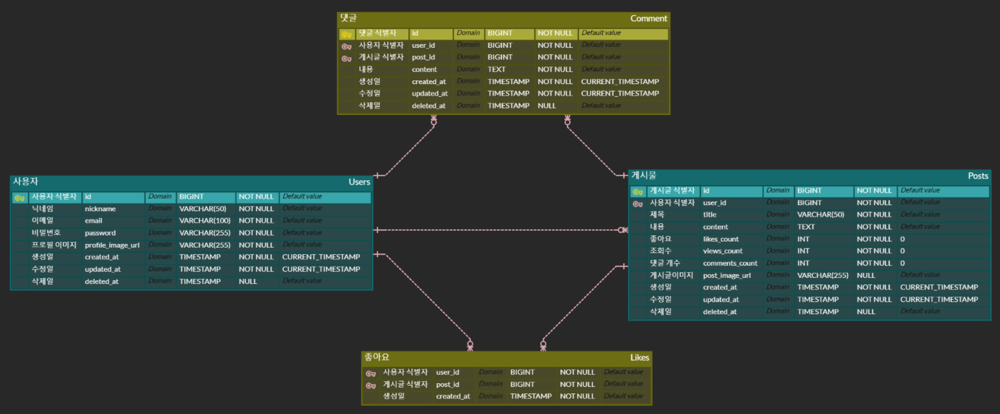

# KTB Community 🚀

KTB Community는 사용자들이 자유롭게 글을 작성하고, 댓글을 남길 수 있는 커뮤니티 웹 애플리케이션입니다. 로그인, 회원가입, 게시글 CRUD, 댓글 기능을 제공하여 사용자들이 원하는 기능을 편리하게 즐길 수 있습니다. 😊

**ERD**를 작성하여 데이터베이스 설계를 명확하게 하였습니다. 효과적인 데이터 관리와 추후 확장 가능성을 고려하여 신중하게 구조를 결정했습니다. 😊

## 📊 KTB Community FrontEnd 주요 구현 내용

### 🔹 [Version 1 README](/community/README_3주차.md)

### 🔹 [Version 2 README](/community/README_4주차.md)

## 🖼️ KTB Community ERD View

## 📌 KTB Community ERD 기본 내용

### 👥 Users Table

- `id` (PK, BIGINT, AUTO_INCREMENT)
- `nickname` (VARCHAR)
- `email` (VARCHAR, UNIQUE)
- `password` (VARCHAR) => **🔑 암호화 처리된 비밀번호**
- `profile_image_url` (VARCHAR) => **🎯 Presigned Profile Image URL**
- `created_at` (TimeStamp) => Default : CURRENT_TIMESTAMP
- `updated_at` (TimeStamp) => Default : CURRENT_TIMESTAMP
- `deleted_at` (TimeStamp) => **Soft Delete**

> `Refresh Token`은 `HTTPOnly Cookie`나 `Redis`를 사용할 예정이라 DB에는 포함하지 않았습니다

> 비밀번호를 암호화하고 저장하여 보안을 강화하고자 합니다.

### 📰 Posts Table 🚨

- `id` (PK, BIGINT, AUTO_INCREMENT)
- `user_id` (FK, BIGINT)
- `title` (VARCHAR)
- `content` (VARCHAR)
- `likes_count` (INT, Default -> 0) => **🚫 NOT JOIN**
- `views_couunt` (INT, Default -> 0)
- `comments_count` (INT, Default -> 0) => **🚫 NOT JOIN**
- `post_image_url` (VARCHAR) => **Presigned Post Image URL**
- `created_at` (TimeStamp) => Default : CURRENT_TIMESTAMP
- `updated_at` (TimeStamp) => Default : CURRENT_TIMESTAMP
- `deleted_at` (TimeStamp) => **Soft Delete**

> 성능 최적화를 위해 좋아요 및 댓글 개수를 별도의 컬럼으로 관리하고 있습니다.

### 💬 Comments Table

- `id` (PK, BIGINT, AUTO_INCREMENT)
- `user_id` (FK, BIGINT)
- `post_id` (FK, BIGINT)
- `content` (VARCHAR)
- `created_at` (TimeStamp) => Default : CURRENT_TIMESTAMP
- `updated_at` (TimeStamp) => Default : CURRENT_TIMESTAMP
- `deleted_at` (TimeStamp) => **Soft Delete**

### ❤️ Like Table

- `user_id` (FK, BIGINT) => **🔑 Composite Key With post_id**
- `post_id` (FK, BIGINT) => **🔑 Composite Key With user_id**
- `created_at` (TimeStamp) => Default : CURRENT_TIMESTAMP

## 🎯 주요 고려 내용

### 🔐 Refresh Token 관리

- RDB에 포함 여부를 고민했지만, 보안을 위해 Redis나 HTTPOnly Cookie를 사용할 예정이라 제외했습니다.

### 🔑 비밀번호 저장 방식

- 평문 저장의 위험성을 고려하여 암호화 알고리즘을 통해 저장하는 방식을 선택했습니다.

### ⚡️ 좋아요 및 댓글 조회 성능 최적화

- 매번 JOIN을 사용하는 대신, 별도의 likes_count와 comments_count 컬럼을 활용하여 성능 최적화를 고려했습니다.

### 🗑️ Soft Delete

- 데이터를 실제로 삭제하지 않고, 삭제 상태로만 표시하여 데이터 복구 가능성을 열어두었습니다.
- 이는 데이터 손실 방지 및 향후 이력 관리에 유용합니다.

### 📅 수정일자 고려

- 하나의 사용자만 수정 가능한 구조라 동시 수정의 가능성이 적어 처음엔 고려하지 않았습니다
- 하지만 수정 일자를 캐싱 여부 판단 등의 용도로 활용할 수 있어 updated_at 컬럼을 추가하였습니다. 🙂

## 🛠 기술 스택

- **MySQL**
- **Redis**
- [**ErdCloud**](https://www.erdcloud.com/)

## 🚀 추후 계획

- **Spring Boot** 프레임워크를 통해 Backend API를 구현할 예정입니다.
- **Vanilla JS** 환경의 Frontend와 연동할 예정입니다.
