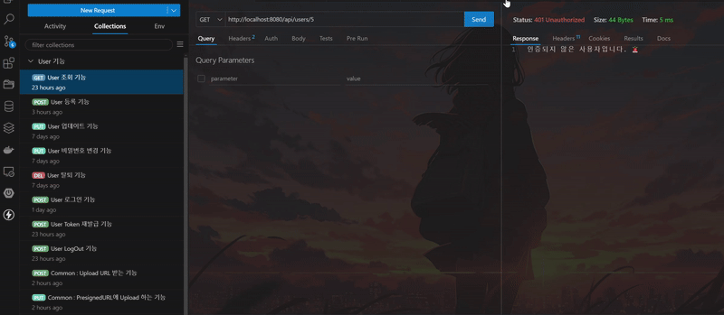

# KTB Community Backend 🚀

KTB Community는 사용자들이 자유롭게 글을 작성하고, 댓글을 남길 수 있는 커뮤니티 웹 애플리케이션입니다. 로그인, 회원가입, 게시글 CRUD, 댓글 기능을 제공하여 사용자들이 원하는 기능을 편리하게 즐길 수 있습니다. 😊

`Spring Boot`로 만들어진 KTB Community의 Backend는 빠른 개발 속도와 유지보수의 용이성을 확보하고, 확장 가능한 어플리케이션을 구축하는 것을 목표로 하고 있습니다. 😊

## 📊 프로젝트 구조

<details>
  <summary>📦 Domain Packages</summary>
  
</details>

<details>
  <summary>🌐 External & Global Packages</summary>
  
</details>

## 📌 주요 기능

### 🔑 Auth 기능 (`/auth`)

#### 1. 🔑 `POST` **로그인** (`/login`)

- 사용자는 이메일과 비밀번호를 입력하여 로그인을 시도합니다.
- 만약, 해당 Email을 가진 사용자가 없을 경우, `INVALID_ERROR` 발생
- 입력된 Password의 암호화가 DB에 저장된 Password와 맞지 않는 경우 `INVALID_ERROR` 발생
- 로그인에 성공하면, `AccessToken`을 `Http Only Cookie`로 반환하고 `RefreshToken`은 `Redis`에 `key/value` 형태로 저장한다.

#### 2. ♻️ `POST` **Token 재발급** (`/refresh`)

- 회원가입, 로그인, `AccessToken` 재발급 API는 `Jwt Filter`에 걸리지 않는다.
- 사용자는 `AccessToken`이 만료되면, 그 외 API는 Filter에 의해 `401 UNAUTHORIZED`가 발생합니다.
- 사용자는 `Redis`에 `RefreshToken`이 남아있다면, `AccessToken`을 재발급 받을 수 있습니다.
- `RefreshToken`도 만료되었다면, `AccessToken`을 재발급 받을 수 없으며 다시 로그인을 해야 합니다.

#### 3. 🚪 `POST` **로그아웃** (`/logout`)

- 사용자는 `AccessToken`이 존재하는 로그인 상태라면, 로그아웃을 요청할 수 있습니다.
- 로그아웃이 성공하면, `Redis`에 있는 `RefreshToken`을 삭제하고, `Cookie`에 있는 `AccessToken`도 없어집니다.

<details>
  <summary class="small-class">🧪 Auth 기능 동작 Test</summary>
  
</details>
<hr/>

### 👤 User 기능 (`/api/users`)

#### 1. 👥 `POST` **회원가입** `()`

- 사용자는 Email, Nickname, Password, ProfileImageUrl을 통해 회원가입을 시도합니다.
- 만약, 해당 Email을 가진 사용자가 존재할 경우, `409 CONFLICT, DUPLICATED_EMAIL` 에러가 발생합니다.
- ProfileImageUrl은 (`/api/s3/upload`)에서 받아낸 `PresignedUrl`을 사용합니다.
- Password는 `PasswordUtil`에 의해 `Encode`되어 저장됩니다.

#### 2. 🔍 `GET` **회원조회** (`/{id}`)

- 사용자는 특정 ID를 가진, 사용자를 조회할 수 있습니다. ( 비밀번호 제외 )

#### 3. 🛠️ `PUT` **회원정보 수정** (`/{id}`)

- 사용자는 본인의 Nickname과 ProfileImageUrl을 수정할 수 있습니다.
- 본인이 아닌 요청에 대한 것은 예외를 발생시켜야 합니다.

#### 4. 🔐 `PUT` **비밀번호 수정** (`/{id}/password`)

- 사용자는 본인의 기존 Password와 새로운 Password를 통해 비밀번호를 변경할 수 있습니다.
- 본인이 아닌 요청에 대한 것은 예외를 발생시켜야 합니다.
- 만약, 기존 Password가 DB에 저장된 Password와 맞지 않는 경우 Login과 다르게 `INVALID_PASSWORD`가 발생합니다.

#### 5. ❌ `DELETE` **회원정보 삭제** (`/{id}`)

- 사용자는 본인의 ID를 통해 탈퇴를 진행할 수 있습니다.
- 본인이 아닌 요청에 대한 것은 예외를 발생시켜야 합니다.
- Soft Delete가 고려되어, Deleted_At를 갱신시키는 것으로 삭제를 표현합니다.

<details>
  <summary class="small-class">🧪 User 기능 동작 Test</summary>
  
</details>
<hr/>

### 📰 Post 기능 (`/api/posts`)

#### 1. ✍️ `POST` **게시물 작성** `()`

- 사용자는 본인의 ID, Title, Content, PostImageUrl을 통해 Post를 작성할 수 있습니다.
- PostImageUrl (`/api/s3/upload`)에서 받아낸 `PresignedUrl`을 사용합니다.

#### 2. 📃 `GET` **게시물 리스트 조회** `()`

- 사용자는 모든 Post를 List로 조회할 수 있습니다.

#### 3. 🔎 `GET` **게시물 단건 조회** (`/{postId}`)

- 사용자는 특정 Post를 조회할 수 있습니다.
- 사용자가 특정 Post를 단건 조회한다면, 해당 Post의 `Views_Count`가 증가합니다.

#### 4. 🛠️ `PUT` **게시물 수정** (`/{postId}`)

- 사용자는 본인이 작성한 Post를 수정할 수 있습니다.
- 본인이 작성한 것이 아닌 요청에 대한 것은 예외를 발생시켜야 합니다.

#### 5. 🗑️ `DELETE` **게시글 삭제** (`/{postId}`)

- 사용자는 본인이 작성한 Post를 삭제할 수 있습니다.
- 본인이 작성한 것이 아닌 요청에 대한 것은 예외를 발생시켜야 합니다.
- Soft Delete가 고려되어, Deleted_At를 갱신시키는 것으로 삭제를 표현합니다.

#### 6. ❤️ `POST` **게시글 좋아요 Toggle** (`/{postId}/like`)

- 사용자는 특정 Post에 대해 좋아요를 Toggle할 수 있습니다.
- `Likes Table`에 `user_id`와 `post_id`를 복합키로 가지는 '좋아요'가 만들어집니다.
- 이와 동시에, 특정 Post의 `Likes_Count`도 계산됩니다.
- `Like Table`은 `Soft Delete`가 고려되지 않았습니다.

<details>
  <summary class="small-class">🧪 Post 기능 동작 Test</summary>
  
</details>
<hr/>

### 💬 Comment 기능 (`/api/comments`)

#### 1. 🗨️ `POST` **댓글 작성** (`/{postId}`)

- 사용자는 특정 게시물에, 댓글을 작성할 수 있습니다.

#### 2. 📄 `GET` **댓글 리스트 조회** (`/{postId}`)

- 사용자는 특정 게시물에, 전체 댓글을 조회할 수 있습니다.

#### 3. ✏️ `PUT` **댓글 수정**

- 사용자는 본인이 작성한 댓글을 수정할 수 있습니다.
- 본인이 작성한 것이 아닌 요청에 대한 것은 예외를 발생시켜야 합니다.

#### 4. 🗑️ `DELETE` **댓글 삭제**

- 사용자는 본인이 작성한 댓글을 삭제할 수 있습니다.
- Soft Delete가 고려되어, Deleted_At를 갱신시키는 것으로 삭제를 표현합니다.

<details>
  <summary class="small-class">🧪 Comment 기능 동작 Test</summary>
  
</details>
<hr/>

### AWS S3 기능 (`/api/s3`)

#### 1. 🖼️ `POST` (`/upload`)

- 사용자는 "User 가입, 수정" 혹은 "Post 가입, 수정" 할 때, 미리 배정된 S3 Bucket 위치의 주소를 받아낸다.
- 사용자는 해당 URL에 `PUT` 요청을 통해, 이미지를 S3 Bucket에 Upload할 수 있다.
- 그리고 받았던 URL을 그대로, Server에게 전달한다.

<details>
  <summary class="small-class">🧪 AWS S3 기능 동작 Test</summary>
  
</details>
<hr/>

## 🎯 주요 고려사항

### 📦 패키지 구조 정리

- 프로젝트의 구조를 Package의 이름으로 명확하게 구분될 수 있도록 잡았습니다.
- Main Business Logic을 담당하는 `domain` Package에는 `Auth`, `User`, `Post`, `Comment`, `Like` Logic이 포함되어 있습니다.
- 외부 Library 혹은 Service를 사용하는 `external` Package에는 `Jwt`, `Aws`, `Redis` Logic이 포함되어 있습니다.
- KTB Community 전체에 적용된다는 것을 의미하는 `global` Package에는 `Cors`, `Security`, `Filter`, `Exception`, `Util` Logic이 포함되어 있습니다.

### 🛡️ Jwt를 활용한 인증/인가

- `AccessToken`과 `RefreshToken`을 활용한 인증/인가 Logic을 구성했습니다.
- `AccessToken`은 Client단의 `Http Only Cookie`로 저장되어, API 요청마다 검증됩니다.
- `RefreshToken`은 `Redis`에 `Key/Value`로 저장되어, `AccessToken`을 재발급하는데 사용됩니다.
- 이를 통해 `Redis`로 `Session`과 같은 역할을 하도록 했습니다.

### 🗑️ Soft Delete

- `Like`를 제외한 모든 Table에서는 `Soft Delete`를 채택하고 있습니다.
- Column에 있는 `deleted_at`을 통해, 삭제 요청이 들어오면 갱신하여 체크를 합니다.
- 실제로 삭제가 이루어지는 것이 아닌, "체크"를 통해 삭제를 표현하여 부하를 최소화합니다.

### ☁️ AWS의 Presigned URL

- Image와 관련된 데이터를 직접 `Client`와 `Server` 사이에서 통신하는 것에 대한 부담을 느껴 도입하게 되었습니다.
- AWS의 S3 Bucket을 활용하고 `Server`에서는 미리 오픈된 URL값을 Client에게 전달합니다.
- Client는 해당 URL에 Image를 `PUT`을 통해, 직접 S3 Bucket에 Upload 합니다.
- 이러한 과정을 통해, 무거운 Image 파일이 직접 통신 과정에 전달되는 과정을 생략했습니다.

## 🧩 주요 에로사항

### 🔐 API 요청에 대한 본인 확인 Logic의 부재

- 현재 대부분의 API는 인증된 사용자임은 확인하고 있습니다.
- 하지만, 해당 요청이 본인의 리소스에 대한 것인지 확인하는 Logic이 부재합니다. ( 다른 사용자 Resource 접근 가능함 )
- 예를 들어, "회원 정보 수정/삭제", "게시글/댓글 수정/삭제" 등은 확인 Logic이 반드시 필요합니다.

### 🧪 AccessToken을 추가 활용 가능성

- 현재 `AccessToken`은 단순하게 인증을 통과하기 위한 용도로만 사용됩니다.
- 해당 `AccessToken`에 담겨 있는 정보를 활용하여, User 수정/삭제 API를 `ID`를 받아내지 않고 구현 가능합니다.
- 이러한 과정을 거치면, 임의의 `ID`를 받아낼 가능성이 없어져 본인 확인 Logic을 대체할 수도 있습니다.

### 🗑️ Like Table의 Soft Delete 부재

- 현재 Like 기능은 단순하게 `Insert/Delete`를 통해 좋아요 여부를 판단합니다.
- 이러한 이유로 성능적인 이슈가 발생할 수도 있으며, **이력이 남지 않기에 추가적인 정보 분석의 여지도 없어집니다.**

## 🛠 기술 스택

- **☕ Java**
- **🌱 Spring Boot**
- **🗃️ MySQL**
- **🧰 Redis**
- **☁️ AWS S3**

## 🛠 프로그램 실행 방법

1.  **프로젝트 다운로드 및 의존성 설치 (Spring Boot 3.4.3, Java 21)**
    ```bash
    git clone https://github.com/100-hours-a-week/2-hwarang-oh-Assignment.git
    cd backend
    ./gradlew clean build
    ```
2.  **application.yml 설정 확인**
    <details>
      <summary class="small-class">🔎 yml 설정 확인하기</summary>
       
       ```groovy
    server:
        port: 8080
    spring:
        application:
          name: backend
        output:
          ansi:
            enabled: always

        datasource:
          url: jdbc:mysql://localhost:3306/ktb_community
          driver-class-name: com.mysql.cj.jdbc.Driver
          username: your-username
          password: your-password

        jpa:
          database-platform: org.hibernate.dialect.MySQLDialect
          hibernate:
            ddl-auto: update
          show-sql: true

        data:
          redis:
          host: localhost
          port: 6379

    jwt:
        secret: your-secret
        expiration:
          access: 3600000
          refresh: 604800000

    aws:
        region: your-region
        s3:
          bucket : your-bucket
          duration: 900
        credential:
          accessKey: your-accessKey
          secretKey: your-secretKey

    ```
    </details>
3.  **Redis 동작 확인**

    ```bash
    docker run --name redis -p 6379:6379 -d redis
    ```

4.  **프로그램 실행**
    ```bash
    ./gradlew bootRun
    ```

## 🚀 추후 계획

### 🔧 **JPA 도입 예정**

- 현재는 `JDBC Template` 기반이나, 유지보수성과 생산성을 위해 `JPA`로 리팩토링 예정

### 🛡️ **본인 확인에 대한 인증/인가 로직 보완**

- 본인 여부 확인 로직을 서비스단에서 더욱 명확히 구분하고 테스트 추가 예정

### 🧪 **테스트 코드 작성**

- 핵심 기능 위주로 단위 테스트 및 통합 테스트 작성 계획

### 🌐 **프론트엔드 연동**

- 실제 프론트 연동을 통해 UX 흐름 검증 예정
