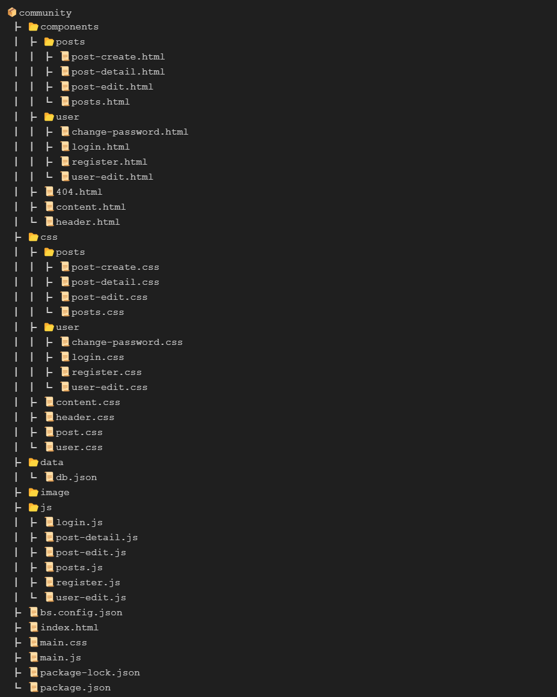
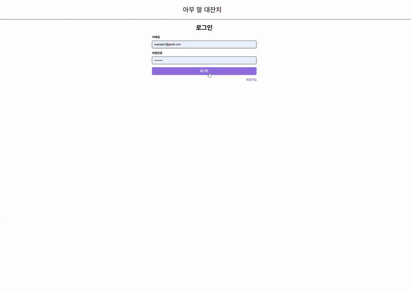

# KTB Community 🚀

KTB Community는 사용자들이 자유롭게 글을 작성하고, 댓글을 남길 수 있는 커뮤니티 웹 애플리케이션입니다. 로그인, 회원가입, 게시글 CRUD, 댓글 기능을 제공하여 사용자들이 원하는 기능을 편리하게 즐길 수 있습니다. 😊

특히, **Vanilla JS**를 활용하여 SPA(Single Page Application)로 동작하는 것이 이 프로젝트의 가장 큰 매력입니다. 빠르고 끊김 없는 사용자 경험을 제공하며, 동적인 콘텐츠 렌더링을 통해 더욱 직관적인 커뮤니티 환경을 조성하였습니다.

## 📊 프로젝트 구조



## ✨ 프로그램 시연



## 📌 주요 기능

### 👤 사용자 기능

- **로그인 (/)** : 사용자는 계정을 통해 **KTB Community** 서비스에 접속할 수 있습니다.
- **회원가입 (/register)** : 신규 사용자는 회원가입을 통해 서비스를 이용할 수 있습니다.
- **회원정보 수정 (/user/edit)** : 사용자는 본인의 가입 정보를 수정할 수 있습니다.
- **비밀번호 수정 (/user/change-password)** : 사용자는 본인의 비밀번호를 수정할 수 있습니다.

### 📝 게시판 기능 (/posts)

- **게시글 목록 조회 (/posts)** : **KTB Community**의 전체 게시글을 확인할 수 있습니다.
- **게시글 상세 조회 (/posts/:id)** : 선택한 게시글을 상세 조회할 수 있습니다.
- **게시글 수정 (/posts/:id/edit)** : 기존 게시글을 수정할 수 있습니다.
- **게시글 작성 (/pots/create)** : 새로운 게시글을 생성할 수 있습니다.

## 🛠 프로그램 실행 방법

1. **프로젝트 다운로드 및 의존성 설치 (Node.js 필요)**
   ```bash
   git clone https://github.com/100-hours-a-week/2-hwarang-oh-Assignment.git
   cd community
   npm install
   ```
2. **프로그램 실행**
   ```bash
   npm start
   ```
3. **테스트용 로그인 계정**
   - `차은우` : example1@gmail.com / example1\*
   - `김지우` : example2@gmail.com / example2\*
   - `시이나 마시로` : example3@gmail.com / example3\*
   - `김지원` : example4@gmail.com / example4\*
   - `무대 위의 김지원` : example5@gmail.com / example5\*
   - `렘과 람` : example6@gmail.com / example6\*
   - `아리마 카나` : example7@gmail.com / example7\*

## 🔍 주요 구현 방식

### 🌐 SPA 기반의 동적 라우팅 (Routing)

TB Community는 `SPA(Single Page Application)`로 동작하도록 설계되었습니다.
이를 위해 `lite-server`를 활용하여 모든 요청을 단일 index.html로 처리하고, 동적으로 콘텐츠를 로딩합니다.

#### Routing 방식

- URL과 일치하는 페이지를 동적으로 Load하는 `routes` 객체를 정의
- URL 패턴을 분석하여 posts/:id와 같은 동적 라우트를 처리할 수 있도록 구현

```
const routes = {
  "/": { path: "components/user/login.html", render: () => renderLoginPage(USER_STORAGE_KEY) },
  "/posts": { path: "/components/posts/posts.html", render: renderPosts },
  "/posts/:id": { path: "/components/posts/post-detail.html", render: renderPostDetail },
  "/posts/:id/edit": { path: "/components/posts/post-edit.html", render: renderEditPost },
  "/posts/create": { path: "/components/posts/post-create.html" },
  "/user/edit": { path: "/components/user/user-edit.html", render: renderUserEditPage },
  "/user/change-password": {
    path: "/components/user/change-password.html",
    render: renderPasswordChangePage,
  },
  "/register": { path: "/components/user/register.html", render: renderRegister },
};
```

### ⚡ 동적 컴포넌트 로딩

`loadComponent()` 함수를 활용하여 URL에 맞는 HTML 파일을 불러오고, 필요할 경우 추가적인 데이터 Rendering

- fetch()를 이용하여, 해당 경로의 HTML을 불러온 후, innerHTML을 이용하여 삽입

```
async function loadComponent(targetId, file) {
  const target = document.getElementById(targetId);
  const response = await fetch(file);
  const content = await response.text();
  target.innerHTML = content;
}
```

### 📝 Template & Slot을 활용한 UI 구성

- 게시글 목록과 댓글 UI를 동적으로 생성하기 위해 HTML `<template>` 및 `<slot>` 기능을 활용
- 이를 통해, 반복되는 요소들을 보자 직관적으로 Rendering할 수 있도록 구성함

```
<template id="post-template">
  <div class="post-card">
    <div class="post-header">
      <span><slot name="title"></slot></span>
      <span><slot name="date"></slot></span>
    </div>
    <div class="post-user">
      
      <span><slot name="author"></slot></span>
    </div>
    <div class="post-info">
      좋아요 <slot name="likes"></slot> · 댓글 <slot name="comments"></slot> · 조회수
      <slot name="views"></slot>
    </div>
  </div>
</template>
```

## 📂 데이터 저장 방식

- KTB Community의 Data는 `db.json` 파일을 통해 관리됩니다.
- DB에는 `User`, `Post`, `Comment`에 대한 `Data`가 저장되고, 그것들을 실제 DB처럼 나누어서 저장하고 `Join`연산과 비슷한 연산을 수행해서 조회함

## 🛠 기술 스택

- **HTML+**
- **CSS**
- **JavaScript**
- [**lite-Server**](https://www.npmjs.com/package/lite-server)

## 🏆 추가 내용

- JS가 실행되는 브라우저 환경에서, `File System`에 있는 JSON 파일을 수정하지 못하기 때문에, `Post` 요청에 관련한 기능이 구현되지 못함
- 추후, `Server`를 간단하게 정의해서 해결할 예정
