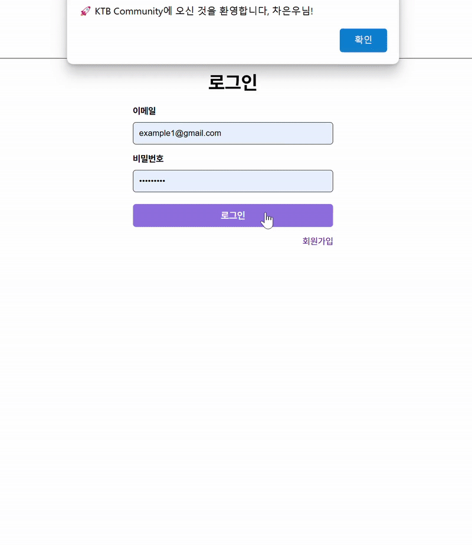

# KTB Community 🚀

KTB Community는 사용자들이 자유롭게 글을 작성하고, 댓글을 남길 수 있는 커뮤니티 웹 애플리케이션입니다. 로그인, 회원가입, 게시글 CRUD, 댓글 기능을 제공하여 사용자들이 원하는 기능을 편리하게 즐길 수 있습니다. 😊

특히, **Vanilla JS**를 활용하여 SPA(Single Page Application)로 동작하는 것이 이 프로젝트의 가장 큰 매력입니다. 빠르고 끊김 없는 사용자 경험을 제공하며, 동적인 콘텐츠 렌더링을 통해 더욱 직관적인 커뮤니티 환경을 조성하였습니다.

## 📊 KTB Community Version 1 & 주요 구현 내용

### 🔹 [Version 1 README](/community/README_3주차.md)

#### 🌐 SPA 기반의 동적 라우팅 (Routing)

#### ⚡ 동적 컴포넌트 로딩

#### 📝 Template & Slot을 활용한 UI 구성

## 📌 KTB Community Version 2 Update

### 🖼️ Modal View 시스템 완성

- 공통 Modal 컴포넌트를 구현하여 재사용성을 높였습니다.
- 옵션 객체 (text, onConfirm, 등...) 를 활용하여 유연한 Modal 사용 가능.
- 필요한 페이지에서 손쉽게 커스텀 Modal을 호출할 수 있도록 구성하였습니

### 💾 JSON Fetch + Local Storage 기반 DB로 변경

- 기존의 JSON 파일을 지속적으로 Fetch하던 방식에서 Local Storage를 활용한 데이터 저장 방식으로 변경하였습니다
- Post, Patch, Delete 기능을 Local Storage를 통해 구현하여 데이터 지속성 확보.
- 👥 User CRUD, 📝 Post CRUD, 💬 Comment CRUD가 안정적으로 동작하도록 개발되었습니다

### 🔍 모든 페이지에서 유효성 검사 (Validation) 구현

- 공통 `Validator.js` 모듈을 활용하여 일관된 유효성 검사 로직을 적용하였습니다.
- 입력값 검증이 필요한 모든 페이지에서 공통 Validator를 호출하여 활용 가능.
- 회원가입, 로그인, 게시글 작성, 댓글 작성 등에서 데이터 검증이 이루어짐

### 🔄 JavaScript 코드 리팩토링 & 주석 추가

- 코드 복잡도 개선: `CodeMetrics` & `SonarQube` 분석 기준, 모든 함수의 복잡도를 10 이하로 유지하도록 리팩토링.
- 가독성 높은 코드 스타일 유지: 코드가 너무 짧거나 이해하기 어려운 부분에는 주석 추가.
- 불필요한 반복 로직 제거 & 모듈화를 통해 효율적인 코드 실행 구조 구현.

## 🛠 프로그램 실행 방법

1. **프로젝트 다운로드 및 의존성 설치 (Node.js 필요)**
   ```bash
   git clone https://github.com/100-hours-a-week/2-hwarang-oh-Assignment.git
   cd community
   npm install
   ```
2. **프로그램 실행**
   ```bash
   npm start
   ```
3. **테스트용 로그인 계정**
   - `차은우` : example1@gmail.com / example1\*
   - `김지우` : example2@gmail.com / example2\*
   - `시이나 마시로` : example3@gmail.com / example3\*
   - `김지원` : example4@gmail.com / example4\*
   - `무대 위의 김지원` : example5@gmail.com / example5\*
   - `렘과 람` : example6@gmail.com / example6\*
   - `아리마 카나` : example7@gmail.com / example7\*

## 🎥 프로그램 시연

### 📝 Register & Logic 기능



### 📰 Post 기능


### 💬 Comment 기능


## 🛠 기술 스택

- **HTML+**
- **CSS**
- **JavaScript**
- [**lite-Server**](https://www.npmjs.com/package/lite-server)
- [**CodeMetrics**](https://marketplace.visualstudio.com/items?itemName=kisstkondoros.vscode-codemetrics)
- [**SonarQube**](https://marketplace.visualstudio.com/items?itemName=kisstkondoros.vscode-codemetrics)

## 🏆 추가 내용

- 추후, `Server.js`와 DataBase를 활용하여, 더 완성도 높은 구현 예정
